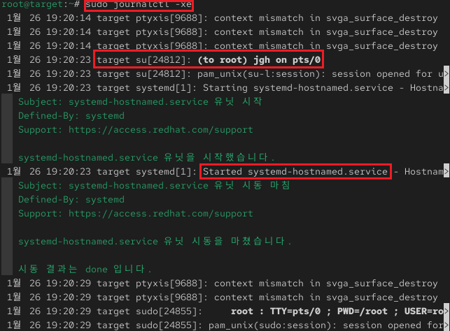
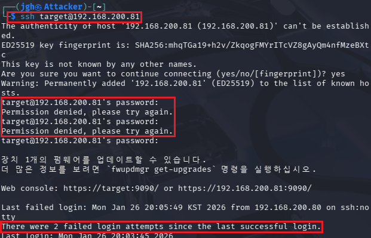
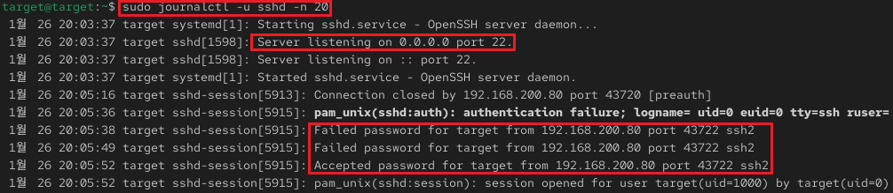

## 1_monday 실습 상세 분석 보고서 (1주차)

---

## 1. 시스템 로그의 흐름 파악 (`journalctl`)
- **실습 목표:** RHEL 통합 로그 관리 도구인 `journalctl`의 사용법을 익히고 시스템 이벤트 추적 기법을 습득함.
- **주요 명령어:** `sudo journalctl -xe`, `sudo journalctl -u sshd -n 20`
- **실습 내용:** 시스템의 전체 활동 로그를 모니터링하고, 특정 서비스(SSHD)에서 발생하는 보안 이벤트를 정밀 분석함.

---

### 수행 기록 및 증적 자료

#### ① 시스템 로그 모니터링 및 권한 상승 확인

* **분석:** `journalctl -xe` 명령을 통해 시스템의 실시간 메시지를 확인하고 주요 관리자 활동을 추적함.
* **상세:** - **Command Execution:** 로그 상단에서 `sudo journalctl -xe` 명령이 실행된 기록을 확인.
    - **Privilege Escalation:** 특정 시점에 `target` 계정이 `su` 명령을 사용하여 `root` 권한으로 전환(`to root`)된 기록과 할당된 터미널(`pts/0`) 정보 식별.
    - **Service Status:** `systemd-hostnamed.service` 유닛이 정상적으로 시작되었음을 알리는 로그 확인.

#### ② 외부 접속 및 인증 실패/성공 분석

* **분석:** 공격자(Kali)가 Target 서버로 SSH 접속을 시도할 때 발생하는 클라이언트 측 반응과 서버의 누적 기록을 분석함.
* **상세:** - **Access Attempt:** 공격자(192.168.200.80)가 `ssh target@192.168.200.81`을 통해 접속 시도.
    - **Authentication Failure:** 패스워드 오입력으로 인해 `Permission denied` 현상이 반복적으로 발생하는 것을 확인.
    - **Historical Tracking:** 최종 성공 직전, "There were 2 failed login attempts since the last successful login" 메시지를 통해 이전의 실패 이력이 시스템에 누적되어 있음을 검증함.

#### ③ 특정 서비스 기반 상세 로그 추출

* **분석:** `-u` 옵션을 사용하여 SSH 서비스와 관련된 보안 로그만 선별적으로 추출하여 정밀 분석함.
* **상세:** - **Service Listening:** SSH 서비스가 `0.0.0.0` 포트 22번에서 정상적으로 리스닝(Listening)을 시작한 시점 확인.
    - **Event Sequence:** 특정 IP(`192.168.200.80`)로부터 `Failed password`가 2회 발생한 후, 최종적으로 `Accepted password` 로그가 남으며 세션이 수립되는 전체 과정을 추적함.

---

### 실습 기술 요약
* **Integrated Log Analysis:** `journalctl`을 활용하여 수많은 시스템 메시지 중 특정 서비스와 관련된 핵심 보안 데이터만 필터링하는 능력을 배양함.
* **Security Event Correlation:** 외부의 접속 실패 메시지와 서버 내부의 인증 기록이 시간대별로 정확히 일치함을 확인하여 로그 정합성을 검증함.

