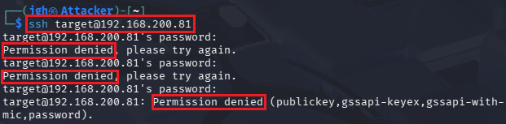

## 2_tuesday 실습 상세 분석 보고서 (1주차)

---

## 1. 외부 공격 시도 탐지 및 보안 로그 분석 (`/var/log/secure`)
- **실습 목표:** 리눅스 시스템의 핵심 보안 로그 파일인 `secure` 로그를 통해 외부 침입 시도를 분석하고 탐지 기법을 숙달.
- **주요 명령어:** `sudo cat /var/log/secure | tail -n 20`
- **실습 내용:** 공격자(192.168.200.80)의 무차별 대입 공격(Brute Force) 시나리오를 바탕으로 생성되는 보안 로그의 패턴을 추적함.

---

### 수행 기록 및 증적 자료

#### ① 외부 SSH 접속 시도 및 거부 반응 확인

* **분석:** 공격자 환경(Kali)에서 타겟 서버로의 SSH 접속 시도가 반복적으로 차단되는 과정을 모니터링함.
* **상세:**
    - **Access Command:** `ssh target@192.168.200.81` 명령을 통해 원격 접속 시도.
    - **Repeated Failures:** 잘못된 인증 정보 입력으로 인해 **Permission denied** 메시지가 3회 연속 발생하는 현상 확인.
    - **Policy Enforcement:** 서버의 보안 정책에 따라 인증 시도가 최종 거부되는 클라이언트 측 증적 확보.

#### ② 시스템 보안 로그 정밀 분석 (`secure` log)

* **분석:** 서버 내부의 `/var/log/secure` 파일을 조회하여 외부 공격자의 IP 주소와 구체적인 실패 원인을 규명함.
* **상세:**
    - **Identification:** 로그상에서 공격 주체인 **192.168.200.80** IP 주소와 사용된 포트 번호(43324)를 명확히 식별함.
    - **Error Patterns:** `password check failed`, `authentication failure`, `Failed password` 등 단계별 인증 실패 로그가 연속적으로 기록됨을 확인.
    - **Session Termination:** 인증 실패가 반복되자 `Connection closed by authenticating user target` 로그와 함께 강제로 세션이 종료된 기록 검증.

---

### 실습 기술 요약
* **Security Log Pattern Recognition:** 인증 실패 시 발생하는 로그의 고유 패턴(Failed password, Auth failure)을 식별하여 비정상적인 접근 시도를 판별하는 능력을 함양함.
* **Attacker Profiling:** 로그에 기록된 원격 호스트(rhost) 정보와 포트 정보를 기반으로 공격의 기점과 공격 방식을 프로파일링하는 기초 과정을 실습함.

