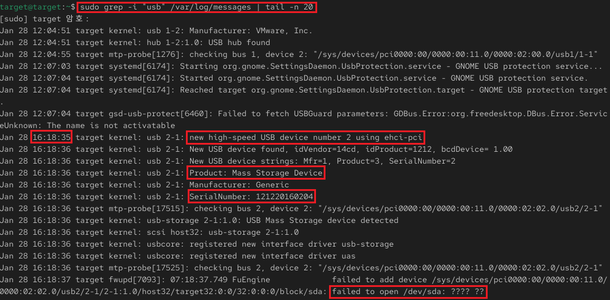

## 3_wednesday 실습 상세 분석 보고서 (1주차)

---

## 1. 시스템 일반 로그 분석 및 하드웨어 이벤트 탐지 (`/var/log/messages`)
- **실습 목표:** 시스템의 전반적인 운영 기록이 담긴 `messages` 로그를 분석하여 소프트웨어 에러와 하드웨어 변경 사항을 추적.
- **주요 명령어:** `sudo grep -i "error" /var/log/messages`, `sudo grep -i "usb" /var/log/messages`
- **실습 내용:** 시스템 내에서 발생하는 다양한 서비스 에러 로그를 식별하고, 외장 저장장치(USB)가 연결될 때 커널에서 인식하는 과정을 분석함.

---

### 수행 기록 및 증적 자료

#### ① 시스템 서비스 에러 로그 분석

* **분석:** `grep` 명령어를 활용하여 시스템 로그 내에 기록된 주요 서비스 오류 및 경고 메시지를 필터링함.
* **상세:**
    - **Service Warnings:** `gnome-session` 및 `gnome-shell`에서 발생한 권한 및 위치 서비스(`geolocation`) 관련 라이브러리 로딩 실패 기록 확인.
    - **Component Failure:** `gsd-usb-protect` 유닛의 `USBGuard` 파라미터 호출 실패와 UI 스케일링 팩터 획득 실패 기록을 통해 시스템 구성 요소의 동작 이상 유무를 파악함.

#### ② 하드웨어 인식 및 USB 장치 로그 분석

* **분석:** 새로운 하드웨어가 시스템에 마운트될 때 커널(kernel) 레벨에서 생성되는 로그를 통해 장치의 상세 정보를 식별함.
* **상세:**
    - **Device Identification:** **16:18:35**에 새로운 고속 USB 장치가 `ehci-pci`를 통해 연결되었음을 확인.
    - **Hardware Profiling:** 연결된 장치가 **Mass Storage Device** 타입임을 식별하고, 고유 시리얼 번호(**121220160204**)를 추출하여 장치의 유일성을 검증함.
    - **Mount Failure:** 로그 하단에서 `/dev/sda` 장치를 여는 데 실패한 기록(`failed to open`)을 확인하여 장치 연결 후 발생한 마운트 오류 상황을 인지함.

---

### 실습 기술 요약
* **Log Filtering Technique:** 방대한 시스템 로그 파일 내에서 특정 키워드(error, usb 등)를 효과적으로 추출하여 문제 해결 및 상태 모니터링에 활용하는 기법을 숙달함.
* **Hardware Forensic Trace:** 시스템 로그에 남는 하드웨어 고유 정보(Serial Number)와 인식 시점의 타임스탬프를 분석하여 비인가 장치 연결 여부를 추적할 수 있는 기초 역량을 배양함.

