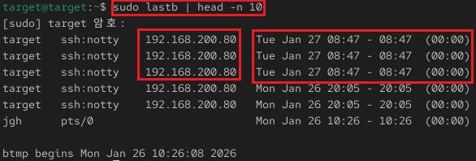

## 4_thursday 실습 상세 분석 보고서 (1주차)

---

## 1. 시스템 접속 이력 및 재부팅 로그 분석 (`btmp`, `wtmp`)
- **실습 목표:** 시스템의 누적된 로그인 실패 기록과 재부팅 이력을 조사하여 비정상적인 접근 시도와 시스템 가동 상태를 파악함.
- **주요 명령어:** `sudo lastb | head -n 10`, `last | grep reboot`
- **실습 내용:** 로그인 실패 로그 파일인 `btmp` 데이터를 조회하여 특정 공격자의 접속 패턴을 분석하고, 시스템이 비정상적으로 종료되거나 재시작된 시점을 추적함.

---

### 수행 기록 및 증적 자료

#### ① 무차별 대입 공격(Brute Force) 실패 이력 분석

* **분석:** `lastb` 명령어를 통해 텍스트 로그가 아닌 바이너리 형태의 누적 실패 기록을 확인하여 보안 위협 요소를 식별함.
* **상세:**
    - **Persistent Attacker:** 특정 IP 주소(**192.168.200.80**)로부터 지속적인 `ssh:notty` 접속 실패가 발생하고 있음을 확인.
    - **Time Correlation:** **Jan 27 08:47**에 집중적으로 발생한 실패 기록을 통해 특정 시점에 집중적인 공격 시도가 있었음을 인지함.
    - **Attack Origin:** 공격자가 터미널을 할당받지 못한 상태(`notty`)에서 시도한 기록을 통해 자동화된 스크립트 기반의 공격 가능성을 분석함.

#### ② 시스템 가동 시간 및 재부팅 이력 분석

* **분석:** `last` 명령어를 활용하여 시스템의 안정성과 예기치 않은 종료 여부를 판단하기 위한 가동 로그를 분석함.
* **상세:**
    - **Reboot Timeline:** 시스템이 최근 **Wed Jan 28 12:04** 및 **Tue Jan 27 08:43**에 재부팅되었음을 확인.
    - **Session Duration:** 로그상에 `still running`으로 표시된 항목들을 통해 현재 시스템이 유지되고 있는 최신 커널 버전(6.12.0-124.8.1.e)과 가동 상태를 검증함.
    - **Operational Continuity:** 일별 재부팅 기록을 통해 정기적인 관리 활동이나 시스템 업데이트 후의 재시작 시점을 파악함.

---

### 실습 기술 요약
* **Access History Auditing:** `lastb`와 `last`를 병행 사용하여 성공한 접속뿐만 아니라 실패한 모든 시도를 추적함으로써 시스템 전반의 가시성을 확보하는 기법을 숙달함.
* **Incident Timeline Construction:** 로그에 기록된 타임스탬프를 기반으로 보안 이벤트(로그인 실패)와 시스템 이벤트(재부팅) 간의 연관 관계를 설정하여 사고 발생 타임라인을 구성하는 능력을 배양함.
