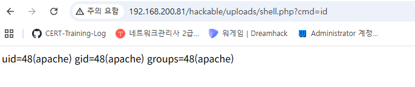
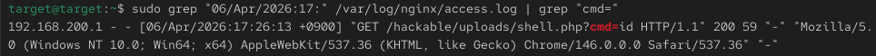
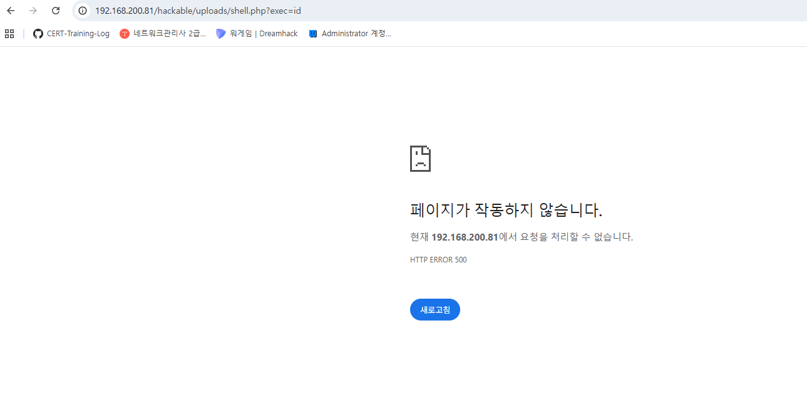
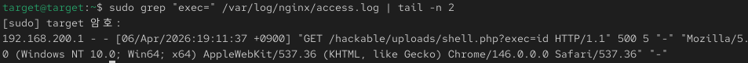
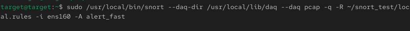
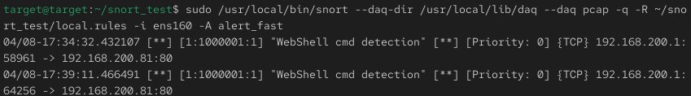
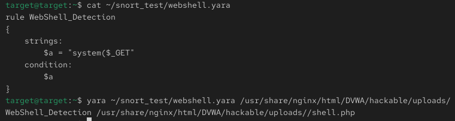

# Incident 07 - WebShell Detection Rule Analysis

---

## 1. 사건 개요

본 보고서는 DVWA(Damn Vulnerable Web Application) 환경에서 File Upload 취약점을 통해 업로드된 WebShell을 이용한
원격 명령 실행(RCE) 공격을 기반으로, 웹 서버 로그 및 탐지 룰을 통해 공격을 식별하는 것을 목적으로 한다.

공격자는 업로드된 WebShell 파일에 접근하여 cmd 파라미터를 통해 시스템 명령을 실행할 수 있으며,
이 과정에서 발생하는 로그 및 네트워크 트래픽, 파일 특성을 기반으로 탐지 가능 여부를 분석하였다.

---

## 2. 분석 환경

| 구분              | 환경                        |
| --------------- | ------------------------- |
| Target          | RHEL                      |
| Web Server      | nginx                     |
| Web Application | DVWA                      |
| 주요 로그           | /var/log/nginx/access.log |

---

## 3. 공격 로그 분석

### 3.1 WebShell 명령 실행

WebShell을 이용하여 cmd 파라미터 기반 명령 실행을 수행하였다.



---

### 3.2 로그 기반 탐지

access.log에서 cmd 파라미터를 포함한 요청을 grep을 통해 탐지하였다.



---

### 3.3 탐지 우회 시도 (exec 파라미터)

cmd 대신 exec 파라미터를 사용하여 탐지 우회를 시도하였다.



---

### 3.4 우회 요청 로그 확인

exec 파라미터 요청은 로그에 기록되지만 기존 cmd 기반 탐지에서는 식별되지 않는다.



---

## 4. 탐지 조건 정의

### 4.1 탐지 키워드

* cmd=
* /hackable/uploads/
* .php

---

### 4.2 탐지 로직

```
cmd= 포함 요청 AND uploads 경로 접근
```

---

## 5. 탐지 룰 및 검증

### 5.1 Snort 기반 탐지

Snort를 이용하여 네트워크 기반 탐지를 수행하였다.



WebShell 요청 발생 시 Snort에서 alert가 발생하는 것을 확인하였다.



---

### 5.2 YARA 기반 탐지

YARA를 이용하여 WebShell 파일 탐지를 수행하였다.



---

## 6. 대응 및 개선 방안

* 업로드 디렉토리에서 PHP 실행 제한
* 입력값 검증 강화
* system(), exec() 등 위험 함수 제한
* 로그 및 IDS 기반 탐지 체계 구축

---

## 7. 결론

본 분석에서는 WebShell을 이용한 원격 명령 실행 공격을 기반으로
로그, 네트워크, 파일 관점에서 탐지 가능성을 확인하였다.

단일 키워드 기반 탐지는 우회 가능성이 존재하므로
다양한 탐지 기법을 결합하는 것이 중요함을 확인하였다.

