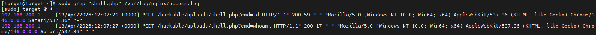
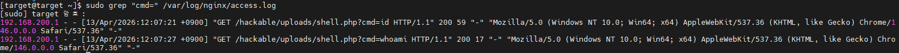
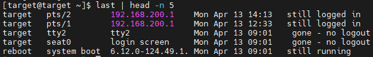
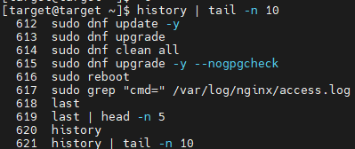
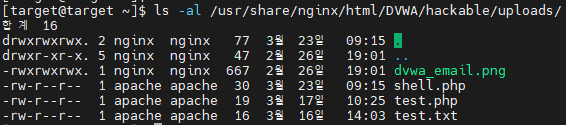
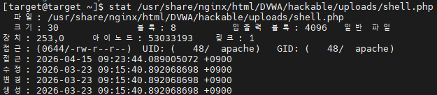
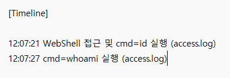

# Incident 08 - WebShell Post-Exploitation Forensic Analysis

---

## 1. 사건 개요

본 분석은 DVWA 환경에서 WebShell 업로드 및 명령 실행 이후,
시스템 내에 남은 로그 및 파일 흔적을 기반으로 침해 행위를 분석하기 위해 수행되었다.

특히 WebShell을 통한 명령 실행 과정과 시스템 내 흔적을 종합적으로 분석하여
공격자의 행위 흐름을 재구성하는 것을 목표로 한다.

---

## 2. 분석 환경

| 구분              | 환경                                         |
| --------------- | ------------------------------------------ |
| Target          | RHEL                                       |
| Web Server      | nginx                                      |
| Web Application | DVWA                                       |
| 주요 로그           | /var/log/nginx/access.log, /var/log/secure |

---

## 3. 초기 침해 흔적 분석

### 3.1 WebShell 접근 로그 분석

access.log 분석 결과 WebShell 접근 및 명령 실행 요청이 확인되었다.

특히 다음과 같은 요청이 확인되었다.

* cmd=id
* cmd=whoami

로그 시간 기준으로 WebShell 접근 이후 연속적으로 명령 실행이 이루어진 것을 확인할 수 있었다.

또한 access.log 분석 결과 모든 요청은 내부 IP(192.168.200.1)에서 발생한 것으로 확인되었다.

이를 통해 본 공격은 외부 공격이 아닌 내부 환경 또는 동일 네트워크 내에서 수행된 것으로 판단된다.

---

### 3.2 명령 실행 흔적 분석

cmd 파라미터를 포함한 요청만 별도로 확인한 결과,
WebShell을 통해 연속적인 명령 실행이 수행된 것을 확인하였다.

본 분석에서는 cmd=id, cmd=whoami 요청만 확인되었으며,
추가적인 명령 실행 흔적은 발견되지 않았다.

이를 통해 공격자가 WebShell을 이용하여 시스템 정보 수집을 수행한 것으로 판단된다.

---

## 4. 시스템 로그 분석

### 4.1 사용자 로그인 기록 분석

last 명령어를 통해 사용자 로그인 기록을 확인하였다.

분석 결과 모든 접속은 내부 IP(192.168.200.1)에서 발생하였으며,
외부 공격자의 직접적인 시스템 로그인 흔적은 확인되지 않았다.

이를 통해 공격은 SSH와 같은 직접 접속이 아닌,
WebShell을 통한 간접적인 명령 실행 형태로 이루어진 것으로 판단된다.

---

### 4.2 명령어 실행 기록 분석

history 명령어를 통해 사용자 명령 실행 기록을 확인하였다.

분석 결과 시스템 업데이트 및 로그 분석 관련 명령이 주로 수행되었으며,
공격자가 직접 시스템에 로그인하여 명령을 실행한 흔적은 확인되지 않았다.

이는 WebShell을 통한 명령 실행이 시스템 쉘 히스토리에 기록되지 않는 특성 때문으로 판단된다.

---

## 5. 파일 시스템 분석

### 5.1 업로드 파일 확인

업로드 디렉토리를 확인한 결과 WebShell 파일(shell.php)이 존재하는 것을 확인하였다.

로그에서 확인된 파일명과 업로드 디렉토리 내 실제 파일명이 일치하는 것을 통해,
공격자가 업로드한 WebShell 파일이 현재까지 존재함을 확인할 수 있었다.

---

### 5.2 파일 정보 분석

stat 명령어를 통해 파일 정보를 확인하였다.

분석 결과 해당 파일은 2026-03-23에 생성된 것으로 확인되었으며,
웹 서버에서 실행 가능한 PHP 파일 형태로 존재하였다.

로그에서 확인된 WebShell 접근 시점(2026-04-13)과 비교했을 때,
파일 생성 시점과 공격 시점 간 약 21일의 차이가 존재하는 것을 확인할 수 있었다.

이는 해당 파일이 이전 시점에 업로드된 후 잠복 상태로 존재하다가
공격 시점에 활용되었을 가능성 또는 정상적인 테스트 파일이 악용되었을 가능성을 시사한다.

---

## 6. 타임라인 분석

로그 및 시스템 흔적을 기반으로 타임라인을 재구성하였다.

정리된 타임라인은 다음과 같다.

* 12:07:21 WebShell 접근 및 cmd=id 실행 (access.log)
* 12:07:27 cmd=whoami 실행 (access.log)

짧은 시간 내 연속적인 명령 실행이 이루어진 점을 통해,
공격자가 WebShell을 이용하여 시스템 정보를 수집한 것으로 판단된다.

---

## 7. 결론

본 분석에서는 WebShell을 이용한 원격 명령 실행 공격을 대상으로
로그 및 시스템 흔적을 기반으로 분석을 수행하였다.

access.log를 통해 WebShell 접근 및 명령 실행이 확인되었으며,
cmd=id, cmd=whoami 요청을 통해 공격자가 시스템 정보를 수집한 것을 확인할 수 있었다.

또한 last 및 history 분석을 통해 공격자가 시스템에 직접 로그인하여 명령을 실행한 흔적은 존재하지 않았으며,
WebShell을 통한 간접적인 명령 실행 형태의 공격임을 확인하였다.

파일 시스템 분석 결과 WebShell 파일(shell.php)이 존재하는 것을 확인하였으며,
파일 생성 시점과 공격 시점 간 차이를 통해 기존에 존재하던 파일이 공격에 사용된 것으로 판단된다.

이를 종합할 때 본 공격은 파일 업로드 취약점을 통해 WebShell을 확보한 후,
이를 이용하여 시스템 정보를 수집하는 형태의 공격으로 분석된다.

---

## 8. 대응 및 개선 방안

### 8.1 WebShell 파일 제거

확인된 WebShell 파일(shell.php)은 즉시 삭제하여 추가적인 악용을 방지해야 한다.

---

### 8.2 파일 업로드 기능 제한

업로드 디렉토리에서 PHP 파일 실행을 차단하고,
허용된 확장자만 업로드 가능하도록 제한해야 한다.

---

### 8.3 로그 모니터링 강화

cmd=와 같은 의심스러운 파라미터 요청을 지속적으로 모니터링하여
WebShell 기반 공격을 조기에 탐지할 수 있도록 해야 한다.

---

### 8.4 접근 통제 강화

업로드 디렉토리에 대한 접근 권한을 최소화하고,
필요 시 인증 절차를 추가하여 무단 접근을 방지해야 한다.
