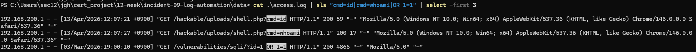
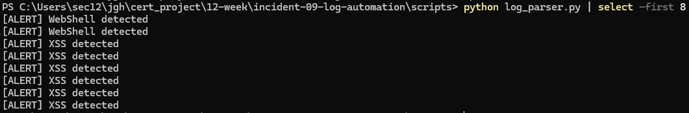
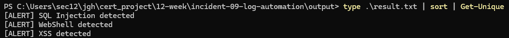

# Incident 09 - Log Automation Detection Analysis

## 1. 사건 개요

본 분석은 기존 실습 과정에서 확보한 WebShell, XSS, SQL Injection 공격 로그를 하나의 access.log 파일로 통합하고, Python 기반 탐지 스크립트를 통해 공격 흔적을 자동 식별하는 과정을 정리한 문서이다.

기존에는 로그를 직접 확인하며 공격 흔적을 분석하였지만, 반복적인 탐지 과정을 자동화하기 위해 Python 스크립트를 활용하였다.

---

## 2. 분석 목표

- WebShell, XSS, SQL Injection 로그를 자동 탐지
- 로그 기반 반복 분석 과정을 자동화
- 탐지 결과를 output 파일로 저장
- 실제 침해 로그 기반 탐지 흐름 구성

---

## 3. 분석 환경

| 항목 | 내용 |
|------|------|
| OS | Windows 11 |
| 분석 도구 | Python 3 |
| 로그 파일 | access.log |
| 분석 방식 | 문자열 패턴 기반 탐지 |

---

## 4. 탐지 기준

### 4.1 WebShell 탐지

WebShell 공격은 명령 실행 흔적을 기준으로 탐지하였다.

탐지 문자열:

```text
cmd=id
cmd=whoami
shell.php
```

---

### 4.2 XSS 탐지

XSS 공격은 스크립트 삽입 흔적을 기준으로 탐지하였다.

탐지 문자열:

```text
<script>
document.cookie
alert(
```

---

### 4.3 SQL Injection 탐지

SQL Injection 공격은 SQL 우회 및 논리 연산 패턴을 기준으로 탐지하였다.

탐지 문자열:

```text
OR 1=1
UNION SELECT
```

---

## 5. 실행 결과

아래 이미지는 실제 분석 과정에서 확인한 로그 증거, parser 실행 화면, 결과 저장 화면을 포함한다.

### 5.1 Access Log 증거



---

### 5.2 Parser 실행 결과



---

### 5.3 Result Output



---

Python 기반 로그 분석 스크립트를 실행하여 공격 패턴을 탐지하였다.

```text
[ALERT] WebShell detected
[ALERT] XSS detected
[ALERT] SQL Injection detected
```

또한 탐지 결과는 result.txt 파일로 저장되도록 구성하였다.

---

## 6. 분석 결과

- WebShell 접근 로그 탐지 성공
- XSS 공격 패턴 탐지 성공
- SQL Injection 요청 탐지 성공
- 탐지 결과를 자동 출력 및 저장 확인

로그 기반 침해 흔적을 수동 분석하지 않고 자동 탐지할 수 있음을 확인하였다.

---

## 7. 결론

이번 분석을 통해 반복적인 로그 분석 과정을 Python 스크립트로 자동화할 수 있음을 확인하였다.

기존에는 로그를 수동으로 탐색하며 공격 흔적을 찾았지만, 탐지 규칙을 기반으로 자동 분석을 수행함으로써 분석 효율성을 높일 수 있었다.

향후에는 탐지 규칙을 확장하여 다양한 공격 패턴을 추가하고, 실시간 로그 탐지 방식으로 발전시킬 수 있을 것으로 판단된다.