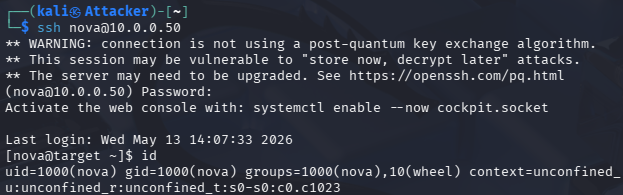
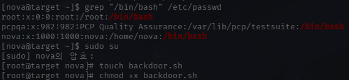
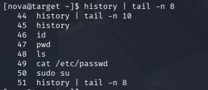
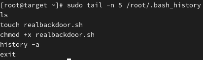
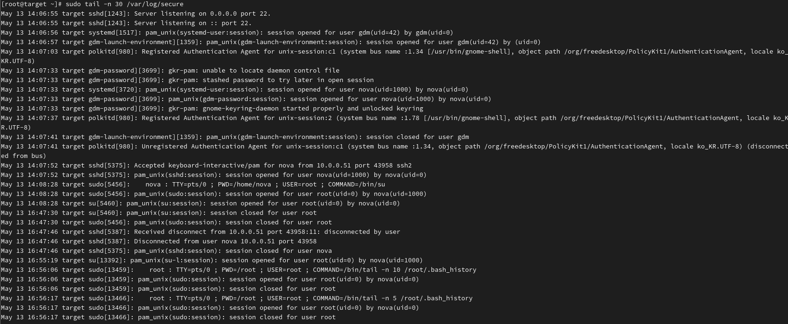

# Incident 10 - Artifact-Based Forensic Analysis

## 1. 사건 개요

본 분석은 Linux 시스템 내부에 남은 아티팩트(Artifacts)를 기반으로 공격자의 행위를 추적하고, 로그 및 명령어 기록을 활용하여 침해 흐름을 재구성한 결과를 정리한 문서이다.

분석 환경은 Attacker(Kali Linux)와 Target(RHEL) 구조로 구성하였으며, SSH 접속 이후 권한 상승 및 의심 파일 생성 행위를 수행하여 포렌식 분석 데이터를 생성하였다.

이후 bash history 및 secure 로그를 기반으로 공격 흐름을 분석하였다.

---

## 2. 분석 목표

- 시스템 내부 아티팩트 기반 침해 행위 분석
- 사용자 및 공격자 명령어 실행 기록 추적
- 로그인 및 권한 상승 이벤트 분석
- 로그 기반 공격 흐름 재구성
- 타임라인 구성 및 행위 분석

---

## 3. 분석 환경

| 항목 | 내용 |
|------|------|
| Attacker | Kali Linux (10.0.0.51) |
| Target | RHEL Linux (10.0.0.50) |
| 분석 대상 | bash_history, secure 로그 |
| 분석 도구 | Linux 기본 명령어 |
| 분석 방식 | 행위 기반 포렌식 분석 |

---

## 4. 분석 대상

### 4.1 사용자 명령어 기록 분석

```text
history
```

사용자가 실행한 명령어 기록을 통해 공격 흐름을 분석하였다.

분석 결과 다음과 같은 행위가 확인되었다.

```text
cat /etc/passwd
sudo su
```

---

### 4.2 root 권한 행위 분석

권한 상승 이후 root 계정에서 수행된 명령어를 분석하였다.

```text
touch backdoor.sh
chmod +x backdoor.sh
```

이를 통해 의심 파일 생성 및 실행 권한 부여 행위를 확인하였다.

---

### 4.3 secure 로그 분석

```text
/var/log/secure
```

SSH 로그인 및 sudo 사용 기록을 분석하였다.

다음과 같은 이벤트를 확인하였다.

```text
Accepted keyboard-interactive/pam for nova
sudo: nova : USER=root ; COMMAND=/bin/su
session opened for user root
```

---

## 5. 실행 결과

### 5.1 SSH 접속 확인



---

### 5.2 사용자 및 권한 상승 행위



---

### 5.3 사용자 명령어 기록



---

### 5.4 root 권한 명령어 기록



---

### 5.5 secure 로그 분석



---

## 6. 타임라인 재구성

```text
[2026-05-07 11:38:39]
SSH 로그인 성공 확인
- 사용자: nova
- 접속 IP: 10.0.0.51

[2026-05-07 11:53:48]
sudo su 명령을 통한 root 권한 상승 확인

[2026-05-07 11:53:48]
root 세션 생성 확인

[2026-05-07 15:43:26]
추가적인 sudo su 실행 기록 확인

[2026-05-07 15:43:26]
root 권한 세션 생성 확인

[2026-05-07 15:44:00]
backdoor.sh 파일 생성 및 실행 권한 부여 확인
- touch backdoor.sh
- chmod +x backdoor.sh

[2026-05-07 15:45:12]
root 세션 종료 확인
```

---

## 7. 분석 결과

- SSH 원격 접속 기록 확인
- sudo 기반 권한 상승 행위 확인
- root 권한 세션 생성 확인
- bash history 기반 명령어 추적 성공
- 의심 파일(backdoor.sh) 생성 행위 확인
- secure 로그 기반 행위 흐름 재구성 성공

로그 기반 분석뿐 아니라 시스템 내부 흔적을 기반으로 공격자의 행위를 추적할 수 있음을 확인하였다.

---

## 8. 결론

이번 분석을 통해 시스템 내부 아티팩트를 활용하여 공격자의 행위를 추적하고, 시간 흐름 기반으로 침해 사고를 재구성할 수 있음을 확인하였다.

특히 bash history 및 secure 로그를 통해 SSH 접속, 권한 상승, 의심 파일 생성 행위를 식별할 수 있었으며, 포렌식 관점에서 공격 흐름을 분석할 수 있었다.

향후에는 파일 무결성 분석, 메모리 분석 및 추가 시스템 로그 분석을 통해 보다 심화된 포렌식 분석으로 확장할 수 있을 것으로 판단된다.
