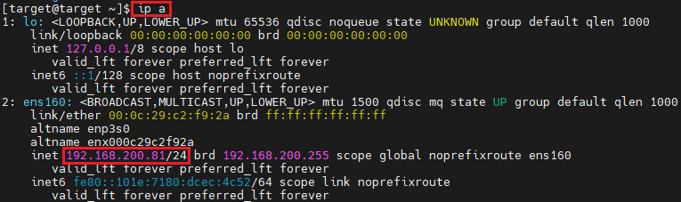

## 1_monday 실습 상세 분석 보고서 (2주차 월요일)

---

## 1. 네트워크 환경 및 세션 확인
- **실습 목표:** 시스템의 IP 정보와 현재 열려 있는 네트워크 서비스(Port) 및 연결 상태 확인
- **주요 명령어:** `ip a`, `sudo netstat -antp`
- **실습 내용:** 공격자와 타겟의 통신 전 환경을 식별하고, 실제 수립된 세션의 프로세스 정보를 분석함.

### 주요 분석 결과
* **IP 주소 식별:**
    - **타겟 서버 IP:** `192.168.200.81` 주소를 통해 분석 대상 서버 식별 완료.
    - **공격자(Kali) IP:** `192.168.200.80` 주소를 통해 로그 분석 시 소스 IP를 추적할 수 있는 기반 마련.
* **서비스 및 세션 분석:**
    - **포트 확인:** SSH 서비스(`port 22`)가 `LISTEN` 상태로 정상 동작 중임을 확인.
    - **세션 추적:** 현재 연결된 세션의 PID(`9980`, `9976`)와 프로세스명(`sshd-session`)을 대조하여 실시간 접속 현황 파악.

---

### 수행 기록 및 증적 자료

#### ① 타겟 서버 IP 확인

* **분석:** `ens160` 인터페이스의 `inet 192.168.200.81/24` 정보를 통해 서버의 네트워크 주소 확인.

#### ② 공격자(Kali) IP 확인

* **분석:** 공격자 단말의 IP가 `192.168.200.80`임을 확인하여 추후 상관분석의 데이터 소스로 활용.

#### ③ 네트워크 연결 및 프로세스 상태 확인

* **분석:** `netstat` 명령어로 22번 포트의 활성화 상태(`LISTEN`)와 실제 수립된 세션(`ESTABLISHED`)의 PID 정보를 성공적으로 수집함.

---

### 실습 기록 요약
* **데이터 정합성 확보**: `ip a` 명령어를 통해 타겟 서버(`192.168.200.81`)와 공격자(`192.168.200.80`)의 IP를 각각 대조 확인하여 분석의 정확성을 기함.
* **서비스 가동 상태 검증**: SSH 서비스가 22번 포트에서 `LISTEN` 상태임을 확인하여 외부 접속이 가능한 환경임을 입증함.
* **세션 및 프로세스 매핑**: `netstat -antp`를 통해 현재 연결된 세션의 PID(`9980`, `9976`)를 추출함으로써, 향후 발생할 로그 분석에서 특정 프로세스를 추적할 수 있는 근거를 마련함.
* **계층적 분석 토대 마련**: 네트워크 계층(IP)과 애플리케이션 계층(SSH 프로세스)의 정보를 동시에 수집하여 보안 이벤트 발생 시 입체적인 추적이 가능하도록 실습을 수행함.
