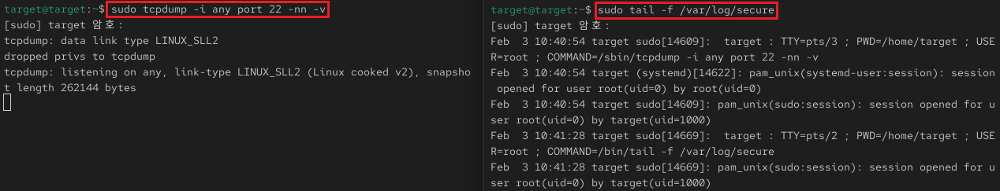
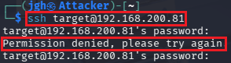
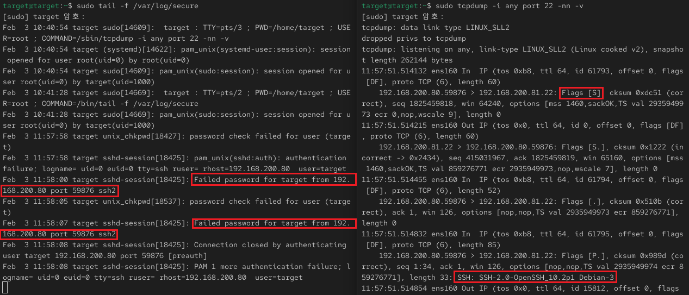
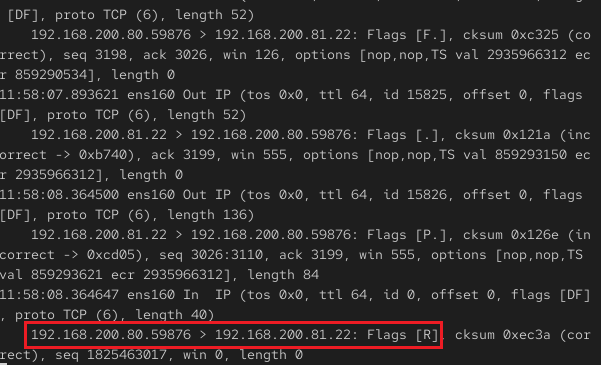

## 2_tuesday 실습 상세 분석 보고서 (2주차)

---

## 1. 패킷 덤프 분석 (`tcpdump`)
- **실습 목표:** CLI 환경에서 실시간 패킷 캡처 및 시스템 로그와의 상관관계 입증
- **주요 명령어:** `sudo tcpdump -i any port 22 -nn -v`
- **실습 내용:** 공격자의 접속 시도 시 발생하는 네트워크 패킷의 흐름을 실시간으로 관찰하고 분석함.

### 주요 분석 결과
* **네트워크 플래그(Flags) 분석:**
    - **[S] (SYN):** 공격자(Kali)로부터 타겟 서버로의 초기 접속 요청 확인.
    - **[P.] (PUSH):** SSH 인증 과정 중 암호화된 데이터가 전송되는 구간 식별.
    - **[R] (RESET):** 인증 실패 또는 세션 종료 시 연결이 강제로 끊기는 지점 확인.
* **데이터 정합성 검증:**
    - `tcpdump` 패킷 유입 시간(11:57:51)과 시스템 로그 생성 시간(11:58:00)이 일치함을 확인하여 공격 행위의 인과관계 입증.

---

### 수행 기록 및 증적 자료

#### ① 분석 환경 초기 세팅 (로그/패킷 대기)

* **분석:** `tail -f`와 `tcpdump`를 동시 가동하여 실시간 모니터링 환경 구축 완료.

#### ② 공격자(Kali) SSH 접속 시도 화면

* **분석:** 공격자 단말에서 확인된 접속 거부(`Permission denied`) 메시지.

#### ③ 패킷 및 로그 상관관계 분석 (핵심 증거)

* **분석:** 패킷의 시작점과 시스템 보안 로그의 기록 시점을 대조하여 외부 공격 입증.

#### ④ 통신 세션 강제 종료 확인

* **분석:** `Flags [R]` 패킷 분석을 통해 연결이 최종적으로 리셋되었음을 확인.

---

### 실습 기술 요약
* **상관분석(Correlation):** 네트워크 트래픽과 시스템 로그를 대조하여 공격 이벤트를 입체적으로 분석함.
* **Banner Grabbing:** 패킷 내 SSH 버전 정보를 통해 대상의 서비스 환경을 식별하는 기법 이해.
