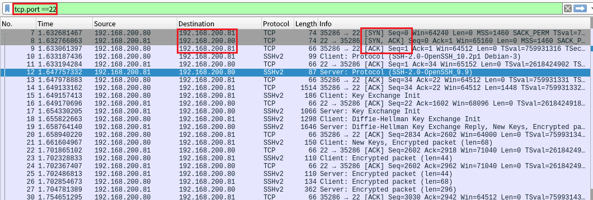
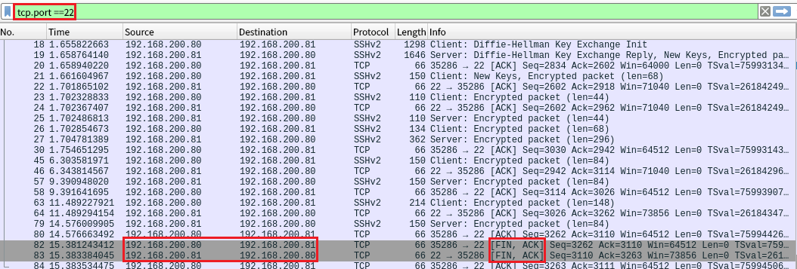

## ## 3_wednesday 실습 상세 분석 보고서 (2주차)

---

## 1. GUI 기반 패킷 상세 분석 (`Wireshark`)
- **실습 목표:** Wireshark를 활용하여 TCP 프로토콜의 연결 수립 및 종료 과정을 시각적으로 분석하고 검증함.
- **주요 필터:** `tcp.port == 22`
- **실습 내용:** 공격자(Kali, 192.168.200.80)와 타겟 서버(RHEL, 192.168.200.81) 간의 SSH 통신 패킷을 캡처하여 TCP 세션의 시작과 끝을 정밀 분석함.

---

### 수행 기록 및 증적 자료

#### ① TCP 3-Way Handshake 분석 (연결 수립 과정)

* **분석:** 상단 필터창(`tcp.port == 22`)을 통해 SSH 트래픽만 추출하여 통신 흐름을 가시화함.
* **상세:** - **Destination IP:** 타겟 서버인 `192.168.200.81`로 향하는 패킷들을 식별함.
    - **Flags:** 빨간색 상자로 강조된 **[SYN]**, **[SYN, ACK]**, **[ACK]** (7~9번 패킷) 과정을 통해 클라이언트와 서버 간의 신뢰성 있는 연결이 수립됨을 확인함.

#### ② TCP 세션 종료 과정 분석 (Connection Termination)

* **분석:** 데이터 전송이 완료된 후 발생하는 세션 종료 단계의 패킷 플래그를 분석함.
* **상세:** - **Source/Destination:** 공격자와 타겟 간의 마지막 통신 주체를 재확인함.
    - **Flags:** 강조된 **82번 및 83번 패킷**의 **[FIN, ACK]** 플래그를 통해 TCP 표준 절차에 따라 양방향 세션이 정상적으로 해제되었음을 입증함.

---

### 실습 기술 요약
* **Display Filter:** 특정 서비스 포트를 타겟팅하여 대규모 트래픽 속에서 분석에 필요한 데이터만 정밀하게 추출함.
* **Protocol Lifecycle Analysis:** TCP 연결의 시작(Handshake)부터 종료(Termination)까지의 전체 라이프사이클을 추적하여 네트워크 통신의 메커니즘을 이해함.
