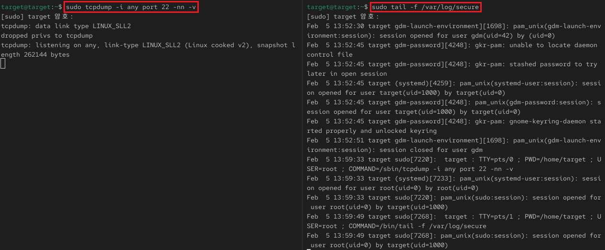
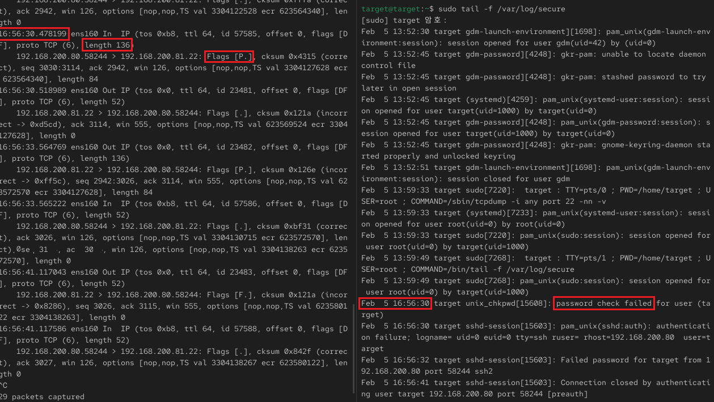
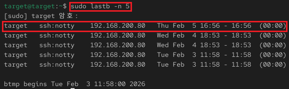

## 4_thursday 실습 상세 분석 보고서 (2주차)

---

## 1. CLI 기반 실시간 트래픽 및 로그 상관분석 (`tcpdump` & `secure log`)
- **실습 목표:** CLI 환경에서 패킷 캡처 도구와 시스템 로그를 동시에 분석하여 보안 이벤트의 인과관계를 증명함.
- **주요 명령어:** `tcpdump -i any port 22`, `tail -f /var/log/secure`
- **실습 내용:** 공격자(192.168.200.80)의 SSH 접속 시도가 시스템 로그에 기록되는 과정을 타임스탬프(시간) 기준으로 정밀 대조함.

---

### 수행 기록 및 증적 자료

#### ① 분석 환경 및 접속 시도 확인

* **분석:** 공격 전, 패킷 수신 상태와 로그 기록 상태를 실시간으로 모니터링하기 위한 듀얼 터미널 환경을 구축함.
* **상세:** - **Monitoring:** 왼쪽 터미널은 포트 22번 트래픽을, 오른쪽 터미널은 `/var/log/secure`를 추적함.
    - **Attack Evidence:** 공격자 터미널(Kali)에서 발생한 패스워드 오류(`Permission denied`) 메시지를 통해 공격 이벤트 발생을 확인함.

#### ② 패킷-로그 타임스탬프 상관관계 분석 (Event Correlation)

* **분석:** 특정 패킷 유입 시점과 로그 생성 시점을 대조하여 공격 행위와 시스템 반응의 일치성을 검증함.
* **상세:** - **Time Synchronization:** **16:56:30**초에 유입된 TCP 데이터 패킷(`Flags [P.]`) 확인.
    - **Log Matching:** 동일 시각인 **16:56:30**에 시스템 로그에서 `password check failed` 이벤트가 기록됨으로써 데이터 간 정합성을 입증함.
    - **Statistics:** 세션 종료 시까지 총 **29개의 패킷**이 캡처된 통계치를 통해 공격 트래픽 규모를 파악함.

#### ③ 인증 실패 로그 증적 확보 (`lastb`)

* **분석:** 휘발성 로그 외에 시스템 데이터베이스(`btmp`)에 남은 사후 증적 기록을 확인함.
* **상세:** - **Database Record:** `sudo lastb` 명령을 통해 **16:56** 시간대에 발생한 `target` 계정의 접속 실패 기록을 최종 검증함.
    - **Origin:** 공격자 IP(`192.168.200.80`)가 시스템 로그와 일치하게 기록되어 있음을 확인함.

---

### 실습 기술 요약
* **Real-time Log Correlation:** 패킷과 로그의 타임스탬프를 대조하여 네트워크 트래픽이 시스템 보안에 미치는 영향력을 인과관계 중심으로 분석함.
* **Evidence Persistence Check:** `tail`을 이용한 실시간 모니터링 정보와 `lastb`를 이용한 저장 데이터의 일치성을 확인하여 디지털 포렌식 관점의 증거 확보 절차를 이해함.
