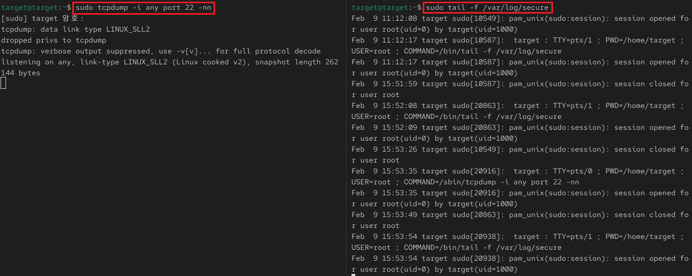
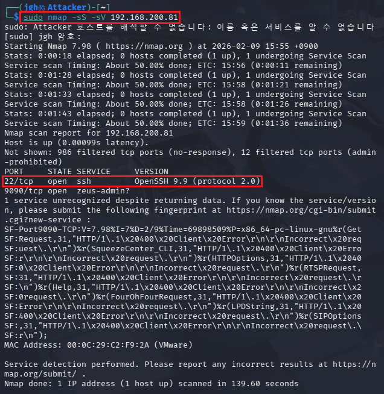
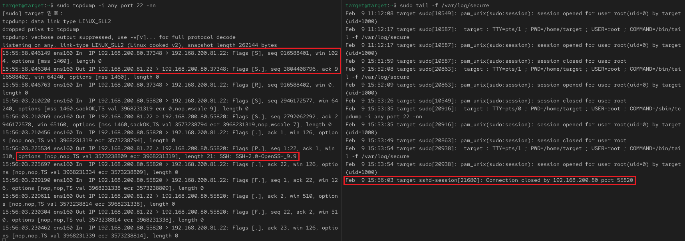

## 1_monday 실습 상세 분석 보고서 (3주차)

---

## 1. Nmap Stealth Scan 및 서비스 버전 탐지 상관분석
- **실습 목표:** 스텔스 스캔(`-sS`)과 버전 탐지(`-sV`) 수행 시 발생하는 네트워크 패킷 변화를 관찰하고, 시스템 로그와의 상관관계를 분석하여 탐지 회피 원리를 이해.
- **주요 명령어:** `sudo nmap -sS -sV [Target_IP]`, `tcpdump -i any port 22`, `tail -f /var/log/secure`
- **실습 내용:** 공격자(Kali)의 정밀 스캔이 타겟 서버의 보안 로그에 남기는 흔적과 패킷 레벨에서 유출되는 정보(OpenSSH 버전)를 대조 분석함.

---

### 수행 기록 및 증적 자료

#### ① 분석 환경 및 모니터링 준비

* **분석:** 공격 유입 전, 타겟 서버에서 네트워크 트래픽(`tcpdump`)과 인증 로그(`secure`)를 동시에 감시할 수 있는 통합 분석 환경을 구축함.
* **상세:** - **Monitoring:** 왼쪽 터미널은 SSH 포트(22번) 트래픽을, 오른쪽 터미널은 `/var/log/secure` 로그를 실시간 추적함.
    - **Initial State:** 스캔 시작 전, 시스템 로그에는 분석 도구 실행(`sudo`) 및 세션 오픈 기록 외에 외부 접속 흔적이 없음을 확인함.

#### ② Nmap 정밀 스캔 및 서비스 버전 식별

* **분석:** Stealth 스캔을 통해 탐지를 최소화하면서 타겟의 열린 포트와 구동 중인 서비스 버전을 정확히 탈취함.
* **상세:** - **Scan Methodology:** `-sS`(TCP SYN Scan)를 기본으로 `-sV`(Version Detection) 옵션을 추가하여 정밀 진단 수행.
    - **Information Gain:** 타겟 서버(192.168.200.81)에서 **OpenSSH 9.9 (protocol 2.0)** 버전이 구동 중임을 확인하였으며, 이는 취약점 분석의 결정적 데이터가 됨.

#### ③ 패킷-로그 대조를 통한 스텔스 및 버전 탐지 특성 검증

* **분석:** 패킷 데이터에는 상세한 정찰 흔적이 기록되나, 시스템 로그에는 구체적인 행위가 남지 않는 보안 사각지대를 증명함.
* **상세:** - **Network Packet:** `tcpdump` 분석 결과, 다량의 `Flags [S]`(SYN) 유입과 더불어 서버가 응답한 `SSH-2.0-OpenSSH_9.9` 배너 정보가 패킷 페이로드에서 포착됨.
    - **Log Evidence:** 시스템 로그에는 구체적인 스캐닝 행위 기록 없이 단순 세션 종료(`Connection closed`) 로그만 발생함.
    - **Correlation Conclusion:** 로그 분석만으로는 공격의 의도(스캔)를 파악하기 어려우며, Payload 수준의 패킷 분석이 병행되어야 함을 입증함.

---

### 실습 기술 요약
* **Stealth Scan Analysis:** TCP 3-Way Handshake를 완성하지 않는 SYN 스캔이 애플리케이션 로그 생성을 회피하는 메커니즘을 이해함.
* **Service Fingerprinting:** 서비스 배너 수집을 통해 단순 포트 오픈 확인을 넘어 구체적인 취약점 공격 대상을 식별하는 과정을 습득함.
* **Log vs Packet Correlation:** 로그 기반 탐지의 한계를 확인하고, 네트워크 트래픽 분석(DPI)을 통한 실질적인 위협 모니터링 방안을 도출함.

