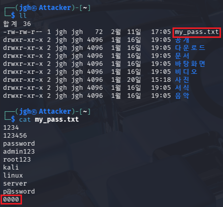
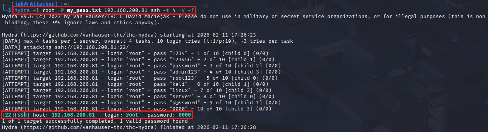
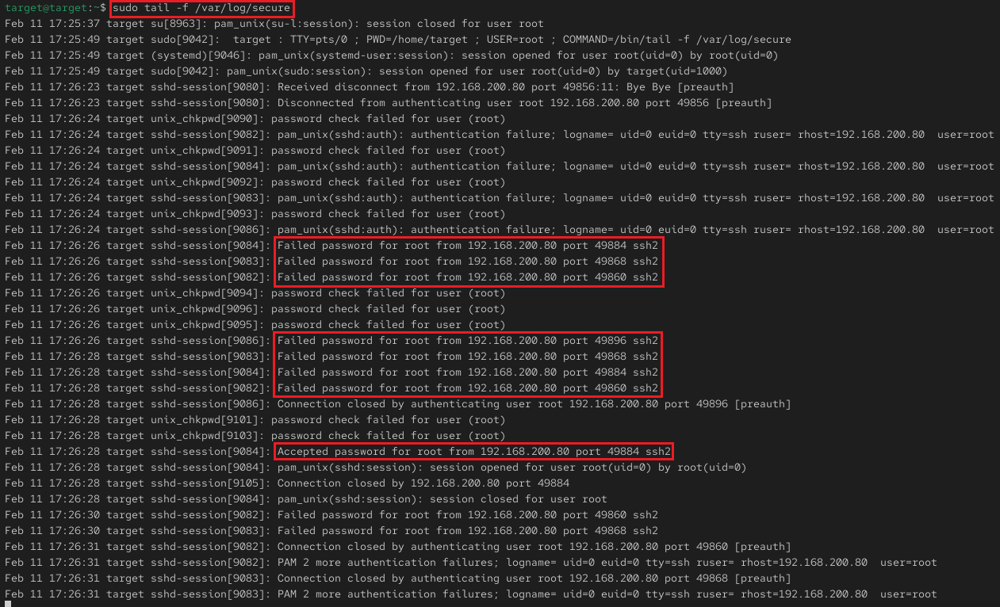

## 3_wednesday 실습 상세 분석 보고서 (3주차)

---

## 1. 무차별 대입 공격(Brute Force)을 통한 계정 탈취 분석
- **실습 목표:** 자동화 도구를 이용한 지속적인 인증 시도가 보안 로그에 남기는 흔적을 추적하고, 성공 시의 로그 패턴을 분석하여 이상 징후 탐지 및 대응 전략을 수립.
- **주요 명령어:** `hydra -l root -P my_pass.txt [Target_IP] ssh -t 4 -V -f`, `tail -f /var/log/secure`
- **실습 내용:** 공격자(Kali)가 취약한 패스워드 목록을 활용해 서버의 SSH 관리자 권한을 탈취하는 과정을 재현하고, 서버 측 보안 로그(`secure`)와의 상관관계를 규명함.

---

### 수행 기록 및 증적 자료

#### ① 공격 준비: 커스텀 패스워드 사전(Wordlist) 구성

* **분석:** 타겟 시스템 환경에 맞춰 유추한 공통 패스워드와 실제 유효 패스워드를 포함한 사전 파일(`my_pass.txt`)을 준비함.
* **상세:**
    - **사전 전략:** 강조된 영역과 같이 리스트 최하단에 실제 비밀번호(`0000`)를 배치하여, 공격 성공 전까지 발생하는 다수의 실패 로그 패턴을 유도함.
    - **사전 공격(Dictionary Attack):** 무작위 대입보다 효율적인 사전 기반 공격 방식을 통해 침투 성공 가능성을 극대화함.

#### ② 공격 실행: Hydra를 이용한 고속 인증 대입 및 성공

* **분석:** 자동화 도구(`Hydra`)의 병렬 접속 기능을 활용하여 단시간 내에 다량의 인증 시도를 수행하고 최종 권한을 탈취함.
* **상세:**
    - **공격 옵션:** 강조된 `-t 4`(4개 세션 병렬) 및 `-V`(상세 출력) 옵션을 통해 초당 다수의 패킷을 발생시키는 자동화 공격의 특성을 부각함.
    - **성공 증적:** 강조된 **`password: 0000`** 결과를 통해 관리자 계정(root)의 SSH 접근 권한이 탈취되었음을 입증함.

#### ③ 서버 측 탐지: 보안 로그(Secure Log) 시계열 분석

* **분석:** 공격 유입 시 서버 로그에 기록되는 실패(`Failed`)와 성공(`Accepted`) 로그의 발생 빈도 및 타임스탬프를 대조함.
* **상세:**
    - **고속 시도 식별:** 강조된 로그 시간을 분석한 결과, **약 4초(17:26:24~28) 내에 9회의 실패 로그**가 집중적으로 발생함. 이는 정상적인 사용자의 접속 범위를 초과한 자동화 도구의 공격 징후임.
    - **침투 성공 확인:** 수차례의 실패 끝에 최종적으로 발생한 **`Accepted password for root`** 로그를 통해 사고 발생 시점을 확정하고 침입 사실을 증명함.

---

### 실습 기술 요약
* **Authentication Attack Mechanism:** 무차별 대입 공격이 시스템 로그에 남기는 시계열적 특징과 '반복 실패 후 성공' 패턴의 심각성을 이해함.
* **Incident Response Insight:** 로그 발생 빈도 분석을 통해 공격을 탐지할 수 있는 임계치(Threshold) 설정의 근거를 마련함.
* **Security Hardening:** 유추 가능한 단순 패스워드(`0000`) 사용의 위험성을 체감하고, 복잡한 비밀번호 설정 및 접속 시도 횟수 제한 정책의 필요성을 도출함.

