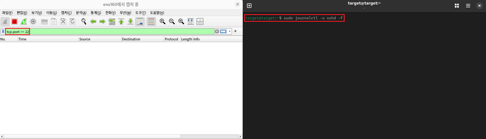
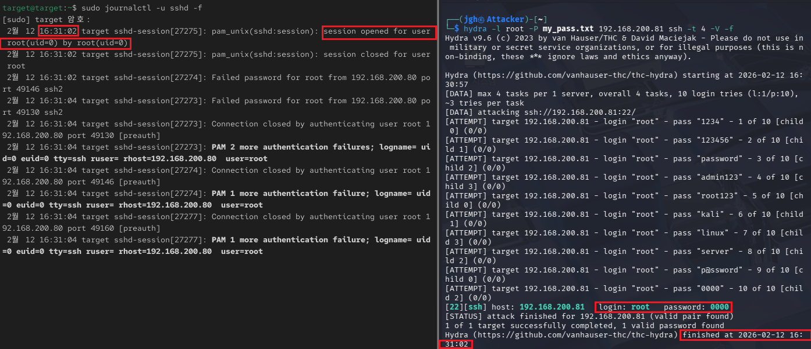
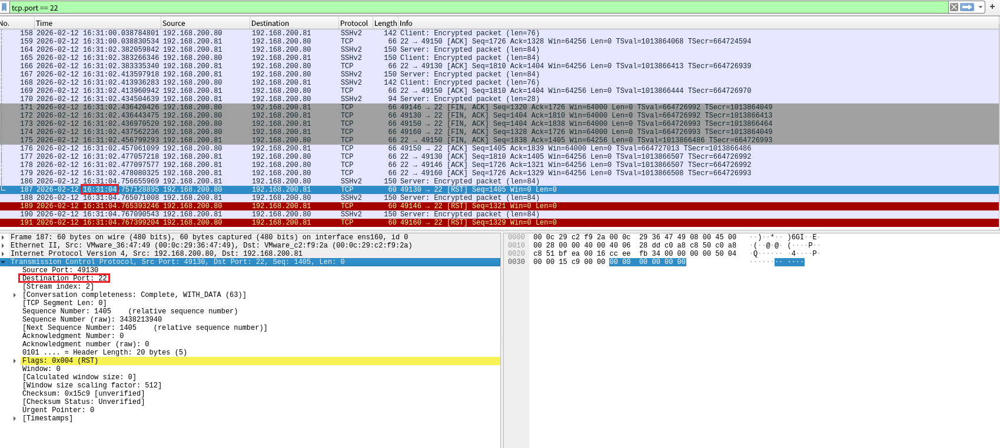

## 4_Thursday 실습 상세 분석 보고서 (상관분석)

---

## 1. 다각도 증적 대조를 통한 침투 사고 상관분석(Correlation Analysis)
- **실습 목표:** 공격 도구(Kali), 타겟 서버 로그, 네트워크 패킷의 타임스탬프와 데이터를 상호 대조하여 공격의 실체와 성공 시점을 기술적으로 증명.
- **주요 도구:** `Hydra`, `journalctl (sshd)`, `Wireshark`.
- **실습 내용:** 단순한 공격 성공 확인을 넘어, 각기 다른 기기에서 생성된 로그들이 하나의 시계열(Time-series) 상에서 일치함을 증명하는 상관분석 기법을 숙달함.

---

### 수행 기록 및 증적 자료

#### ① 분석 환경 구축: 실시간 통합 모니터링 세팅

* **분석:** 공격 유입 전, 서버 로그의 실시간 변동과 네트워크 패킷 흐름을 동시에 관찰할 수 있는 분석 환경을 구축함.
* **상세:**
    - **네트워크 필터:** 강조된 영역과 같이 Wireshark에 `tcp.port == 22` 필터를 적용하여 SSH 관련 트래픽만 정밀 모니터링함.
    - **로그 모니터링:** 서버 측에서 `sudo journalctl -u sshd -f` 명령을 통해 인증 관련 로그를 실시간 추적 대기함.

#### ② 호스트 기반 상관분석: 공격 도구와 시스템 로그 대조

* **분석:** 공격 도구인 Hydra의 종료 시각과 서버 보안 로그에 기록된 세션 생성 시각의 일치성을 확인하여 공격의 유효성을 입증함.
* **상세:**
    - **공격 도구 종료:** 강조된 바와 같이 Hydra가 **16:31:02**에 정답(`0000`)을 찾아 공격을 종료한 시점을 확인함.
    - **침투 성공 로그:** 동일한 시각(**16:31:02**)에 서버 로그상에서 **`session opened for user root`**가 기록되었으며, 이는 패스워드 탈취를 통한 실제 세션 획득을 의미함.

#### ③ 네트워크 기반 상관분석: 패킷 정밀 분석 및 세션 종료 검증

* **분석:** 와이어샤크를 통해 네트워크 계층에서 발생한 패킷의 시간과 서비스 포트를 분석하여 침투 경로를 확정함.
* **상세:**
    - **시간적 일치성:** 강조된 **187번 패킷**의 발생 시간(**16:31:04**)은 앞서 확인한 서버 로그 생성 직후 세션이 정리되는 시점으로, 공격 전체 시나리오의 시간축과 정확히 부합함.
    - **기술적 증거:** 상세 창의 **`Destination Port: 22`**와 **`Flags: 0x004 (RST)`**를 통해 공격 대상 서비스가 SSH임을 재확인하고, 공격 성공 후 연결이 리셋되는 물리적 신호를 포착함.

---

### 실습 기술 요약
* **Cross-Platform Correlation:** 공격 기기, 타겟 시스템, 네트워크 인프라 등 서로 다른 출처의 데이터를 통합 분석하여 사고의 타임라인을 재구성함.
* **Evidence Incontestability:** 단일 로그가 아닌 다각도의 증적(시간, 포트, 플래그)을 제시함으로써 분석 결과의 객관성과 부인 방지(Non-repudiation) 특성을 확보함.
* **Incident Response Strategy:** 상관분석을 통해 확보된 공격자의 IP와 공격 패턴을 기반으로 유사 공격에 대한 방화벽 정책 및 침입 차단 규칙 수립의 근거를 마련함.

