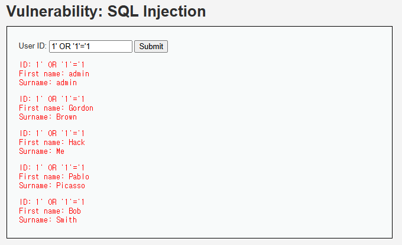
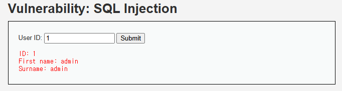
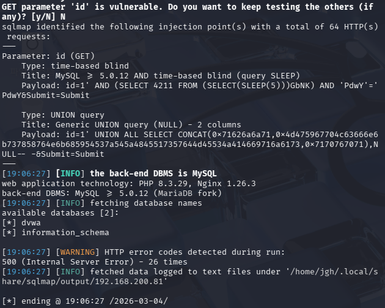
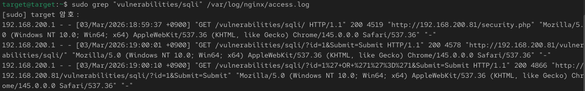
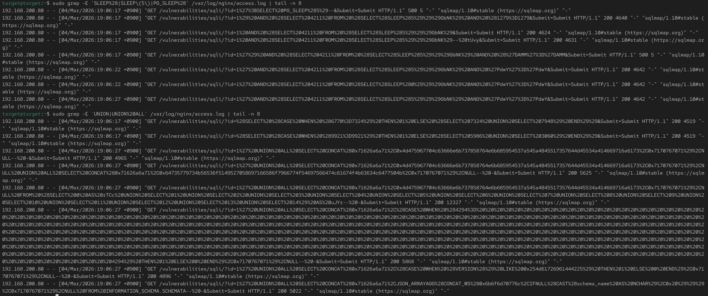

# Incident 02 - DVWA SQL Injection Analysis

## 1. 사건 개요

본 분석은 DVWA(Damn Vulnerable Web Application) 환경에서 발생한 SQL Injection 공격을 재현하고 웹 서버 로그 기반으로 공격 행위를 분석한 결과를 정리한 문서이다.

공격자는 취약한 입력값 검증을 이용하여 SQL Injection을 수행하였으며 자동화 도구(sqlmap)를 사용하여 데이터베이스 정보 수집을 시도하였다.

본 보고서에서는 공격 재현, 웹 로그 분석, 타임라인 재구성 및 침해 지표(IOC)를 기반으로 공격 흐름을 분석하였다.

---

## 2. 분석 환경

| 구분 | 환경 |
|-----|------|
| Target | RHEL |
| Client | Browser / sqlmap |
| Web Server | nginx |
| Web Application | DVWA |
| 주요 로그 | /var/log/nginx/access.log |

---

## 3. 공격 재현 과정

### 3.1 수동 SQL Injection 테스트

DVWA의 SQL Injection 페이지(`/vulnerabilities/sqli/`)에서 다음 페이로드를 이용하여 취약점을 수동으로 테스트하였다.

```sql
' OR '1'='1
```

해당 페이로드는 항상 참(True)이 되는 조건을 생성하여 특정 사용자 정보가 아닌 전체 사용자 데이터가 반환되는 현상을 확인하였다.

이는 사용자 입력값이 SQL 쿼리에 직접 사용되고 있으며 입력값 검증이 수행되지 않는 SQL Injection 취약점이 존재함을 의미한다.



---

### 3.2 정상 요청과 공격 요청 비교

정상적인 요청에서는 특정 ID에 해당하는 사용자 정보만 반환되지만 SQL Injection 페이로드 입력 시 다수의 사용자 정보가 반환되는 것을 확인하였다.



---

### 3.3 SQLMap 자동화 공격 수행

수동 테스트 이후 SQL Injection 취약점을 자동으로 분석하기 위해 SQL Injection 자동화 도구 **sqlmap**을 사용하였다.

```bash
sqlmap -u "http://target/dvwa/vulnerabilities/sqli/?id=1&Submit=Submit" \
--cookie="security=low; PHPSESSID=SESSIONID" \
--dbs
```

sqlmap 분석 결과 다음 사항이 확인되었다.

- GET 파라미터 `id`가 SQL Injection에 취약
- Time-based SQL Injection 가능
- UNION 기반 SQL Injection 가능
- DBMS: MariaDB (MySQL fork)



---

## 4. 웹 로그 분석

### 4.1 Access Log 분석

웹 서버의 `/var/log/nginx/access.log` 로그를 분석한 결과 동일 Source IP(192.168.200.80)에서 DVWA SQL Injection 페이지로 다수의 비정상적인 HTTP 요청이 발생한 것이 확인되었다.

특히 요청 파라미터 `id`에 SQL 구문이 삽입된 형태의 공격 패턴이 반복적으로 나타났다.

확인된 주요 공격 패턴은 다음과 같다.

- `SLEEP(5)` / `PG_SLEEP(5)` → Time-based Blind SQL Injection  
- `UNION SELECT` → 데이터 추출을 위한 UNION 기반 SQL Injection  
- `ORDER BY` → 컬럼 개수 탐색  

또한 access log의 User-Agent 필드에서 다음 문자열이 확인되었다.

```text
sqlmap/1.10#stable
```

이는 공격자가 SQL Injection 자동화 도구인 **sqlmap**을 사용하여 취약점 탐지 및 데이터 추출을 시도했음을 의미한다.





---

### 4.2 공격 단계 분석

로그 패턴을 기반으로 공격 흐름을 분석한 결과 공격자는 다음과 같은 단계로 SQL Injection 공격을 수행하였다.

1️ 취약점 테스트

```text
id=' OR '1'='1
```

→ SQL Injection 취약 여부 확인

2️ 컬럼 개수 탐색

```text
ORDER BY 1
ORDER BY 2
ORDER BY 3
```

→ UNION 공격을 위한 컬럼 구조 확인

3️ Time-based SQL Injection

```text
SLEEP(5)
PG_SLEEP(5)
```

→ 데이터베이스 응답 지연을 이용한 취약점 검증

4️ UNION 기반 데이터 추출

```text
UNION SELECT
```

→ 데이터베이스 정보 추출 시도

---

## 5. 타임라인 재구성

| 시간 | 이벤트 | 근거 로그 | 해석 |
|------|--------|-----------|------|
| 19:06:17 | SQL Injection 요청 발생 | /vulnerabilities/sqli | 공격 시작 |
| 19:06:17 | sqlmap 공격 탐지 | User-Agent: sqlmap | 자동화 공격 도구 사용 |
| 19:06:22 | Time-based SQL Injection | SLEEP / PG_SLEEP | 취약점 검증 |
| 19:06:27 | 컬럼 개수 탐색 | ORDER BY | UNION 공격 준비 |
| 19:06:27 | UNION 기반 공격 수행 | UNION SELECT | 데이터 추출 시도 |

---

## 6. IOC (Indicators of Compromise)

| 구분 | 값 | 설명 |
|------|----|------|
| Source IP | 192.168.200.80 | 공격 수행 IP |
| 공격 대상 URL | /vulnerabilities/sqli/ | SQL Injection 취약 페이지 |
| 공격 파라미터 | id | SQL Injection 발생 파라미터 |
| User-Agent | sqlmap/1.10 | 자동화 공격 도구 |
| 공격 패턴 | SLEEP(5) | Time-based SQL Injection |
| 공격 패턴 | PG_SLEEP(5) | Time-based SQL Injection |
| 공격 패턴 | UNION SELECT | 데이터 추출 공격 |
| 공격 패턴 | ORDER BY | 컬럼 개수 탐색 |
| 로그 위치 | /var/log/nginx/access.log | 웹 서버 접근 로그 |

---

## 7. 대응 및 개선 방안

### 7.1 입력값 검증 강화

사용자 입력값을 SQL 쿼리에 직접 사용하지 않도록 **Prepared Statement (Parameterized Query)** 를 적용하여 SQL Injection 공격을 방지해야 한다.

---

### 7.2 웹 애플리케이션 방화벽(WAF) 적용

다음과 같은 SQL Injection 패턴을 탐지하여 차단할 수 있다.

- UNION SELECT
- SLEEP()
- ORDER BY
- SQL 키워드 기반 공격 패턴

---

### 7.3 로그 기반 공격 탐지

웹 서버 access log에서 다음 항목을 모니터링할 필요가 있다.

- 비정상적인 SQL 키워드
- 반복적인 동일 요청 패턴
- 자동화 공격 도구 User-Agent

---

## 8. 결론

본 분석에서는 DVWA 환경에서 SQL Injection 공격을 재현하고 웹 서버 로그 기반으로 공격 행위를 분석하였다.

분석 결과 동일 Source IP에서 SQL Injection 공격이 수행되었으며 `SLEEP()` 기반 Time-based SQL Injection과 `UNION SELECT` 기반 데이터 추출 시도가 확인되었다.

또한 User-Agent 분석을 통해 공격자가 **sqlmap 자동화 도구**를 사용했음을 확인하였다.

본 사례는 입력값 검증이 수행되지 않는 웹 애플리케이션에서 SQL Injection 공격이 쉽게 발생할 수 있음을 보여준다.

Prepared Statement 적용, WAF 도입, 로그 기반 모니터링을 통해 동일 유형의 공격을 효과적으로 예방할 수 있다.

