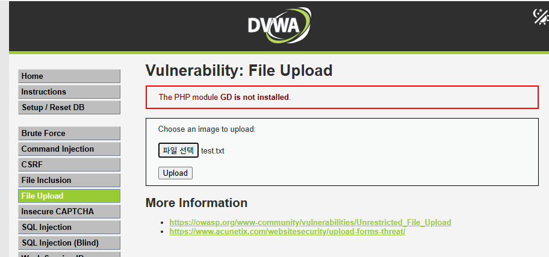
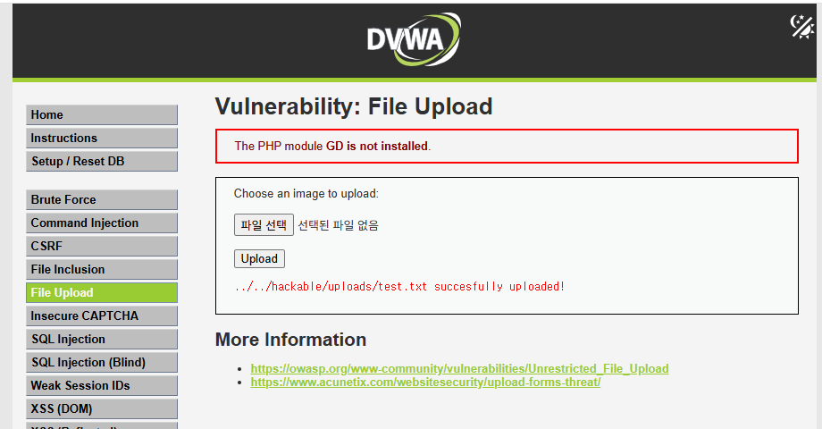
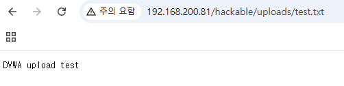
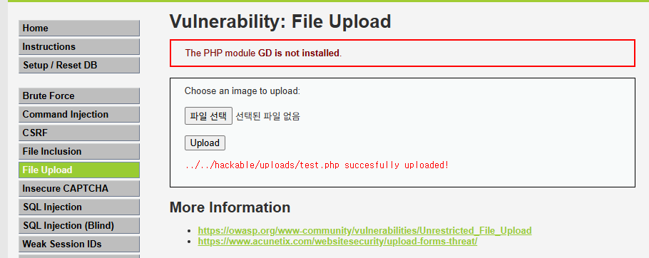
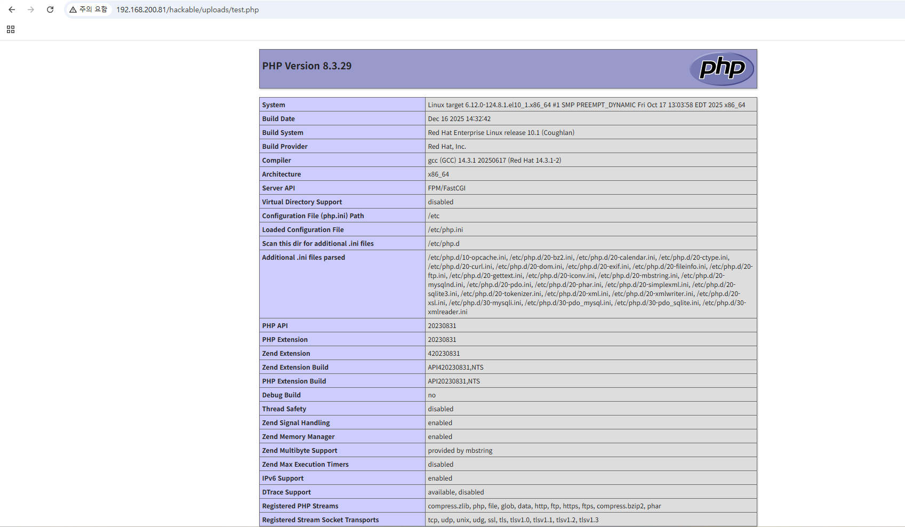
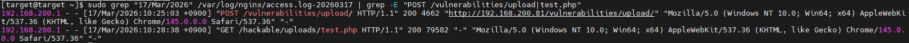

# Incident 04 - DVWA File Upload Vulnerability Analysis

## 1. 사건 개요

본 분석은 DVWA(Damn Vulnerable Web Application) 환경에서 File Upload 취약점을 이용하여 서버에 파일을 업로드하고, 업로드된 파일의 접근 및 실행 여부를 확인하는 실습 문서이다.

공격자는 파일 업로드 기능의 확장자 검증 미흡을 이용하여 일반 파일(txt) 및 서버 실행 가능 파일(php)을 업로드할 수 있으며, 업로드된 파일이 웹 서버 경로를 통해 직접 접근 가능한 경우 추가 공격으로 이어질 수 있다.

본 보고서에서는 txt 파일 업로드와 php 파일 업로드를 수행한 뒤, 업로드된 파일의 직접 접근 및 php 실행 여부를 확인하고 nginx access log를 기반으로 공격 흐름을 분석하였다.

---

## 2. 분석 환경

| 구분 | 환경 |
|------|------|
| Target | RHEL |
| Client | Local Browser |
| Web Server | nginx |
| Web Application | DVWA |
| 주요 로그 | /var/log/nginx/access.log |

---

## 3. 공격 재현 과정

### 3.1 txt 파일 업로드 테스트

로컬에서 다음 내용을 포함한 txt 파일을 생성하였다.

    DVWA upload test

DVWA File Upload 페이지(`/vulnerabilities/upload/`)를 통해 `test.txt` 파일을 업로드하였다.

업로드 성공 후 `/hackable/uploads/test.txt` 경로로 직접 접근하여 파일 내용이 정상적으로 출력되는 것을 확인하였다.

해당 파일은 초기 업로드 이후 추가 접근 요청이 발생할 수 있으므로 access log에는 파일 접근 시점이 별도로 기록될 수 있다.

---

### 3.2 php 파일 업로드 테스트

다음 내용을 포함한 php 파일을 생성하였다.

    <?php phpinfo(); ?>

파일명은 `test.php` 로 저장하였다.

DVWA File Upload 페이지를 통해 업로드를 수행하였으며 업로드 성공 메시지를 확인하였다.

---

### 3.3 업로드된 php 실행 확인

업로드 후 다음 경로로 직접 접근하였다.

    http://192.168.200.81/hackable/uploads/test.php

브라우저에서 PHP 정보 페이지가 출력되었으며 서버에서 업로드된 php 코드가 실제 실행됨을 확인하였다.

이는 File Upload 취약점이 코드 실행으로 이어질 수 있음을 보여준다.

---

## 4. 웹 로그 분석

### 4.1 Access Log 분석

nginx access log에서 업로드 및 실행 요청을 확인하였다.

txt 파일과 php 파일은 서로 다른 시점에 업로드되었으며, access log에는 업로드 요청과 이후 파일 접근 요청이 각각 기록된다.

확인된 주요 로그는 다음과 같다.

    POST /vulnerabilities/upload/
    GET /hackable/uploads/test.php

업로드 요청은 POST 방식으로 기록되었으며 이후 업로드된 php 파일에 대한 GET 요청이 발생하였다.

이는 업로드 후 직접 파일 실행이 이루어진 흐름을 보여준다.

---

### 4.2 공격 단계 분석

1. txt 파일 업로드 수행  
→ 일반 파일 업로드 가능 여부 확인

2. php 파일 업로드 수행  
→ 실행 가능 파일 업로드 확인

3. 업로드된 php 직접 실행  
→ php 코드 실행 여부 확인

---

## 5. 타임라인 재구성

| 단계 | 이벤트 | 해석 |
|------|------|------|
| 1 | txt 파일 업로드 | 일반 파일 업로드 가능 여부 확인 |
| 2 | php 파일 업로드 | 실행 가능 파일 업로드 |
| 3 | php 파일 직접 접근 | php 코드 실행 확인 |

---

## 6. IOC (Indicators of Compromise)

| 구분 | 값 | 설명 |
|------|------|------|
| Source IP | 192.168.200.1 | 공격 수행 IP |
| Upload URL | /vulnerabilities/upload/ | 업로드 페이지 |
| Execution URL | /hackable/uploads/test.php | 실행 경로 |
| 업로드 파일 | test.txt | 일반 파일 |
| 업로드 파일 | test.php | php 실행 파일 |
| 요청 방식 | POST / GET | 업로드 / 실행 |
| 로그 위치 | /var/log/nginx/access.log | 웹 서버 접근 로그 |

---

## 7. 대응 및 개선 방안

### 7.1 확장자 검증 강화

허용된 파일 확장자만 업로드 가능하도록 화이트리스트 방식 적용이 필요하다.

### 7.2 MIME-Type 검증

파일 확장자뿐 아니라 실제 MIME-Type을 함께 검사해야 한다.

### 7.3 업로드 경로 실행 제한

업로드 디렉토리에서 php 실행을 차단해야 한다.

### 7.4 업로드 파일명 무작위화

원본 파일명을 그대로 사용하지 않고 서버 내부 랜덤 이름으로 저장해야 한다.

### 7.5 로그 기반 탐지

다음 패턴을 지속적으로 모니터링할 필요가 있다.

- POST /vulnerabilities/upload/
- .php
- /hackable/uploads/

---

## 8. 결론

본 실습에서는 DVWA 환경에서 File Upload 취약점을 이용하여 txt 및 php 파일 업로드를 수행하였다.

특히 php 파일 업로드 후 웹 경로를 통해 직접 실행됨을 확인함으로써 단순 업로드 취약점이 코드 실행으로 이어질 수 있음을 확인하였다.

향후 실제 환경에서는 업로드 경로 분리, 실행 제한, 확장자 검증이 반드시 필요하다.

